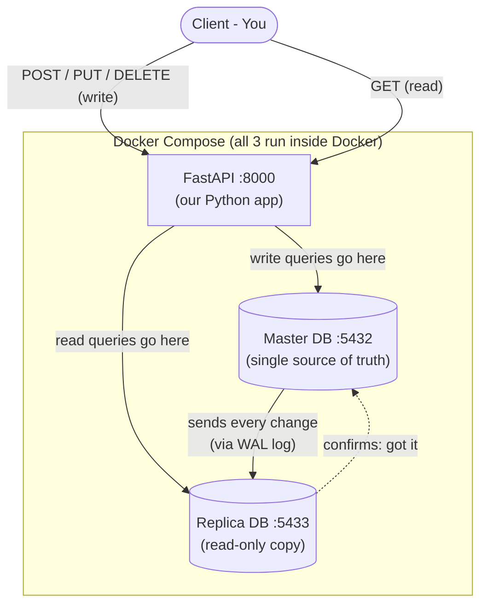
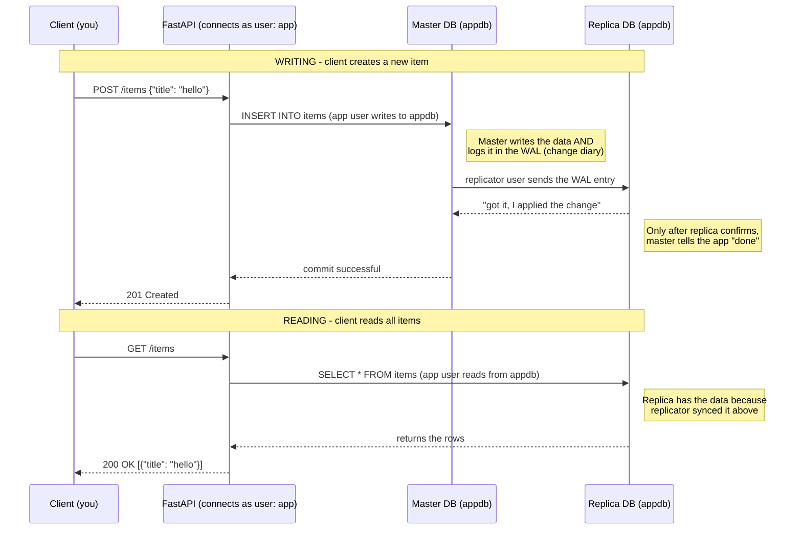
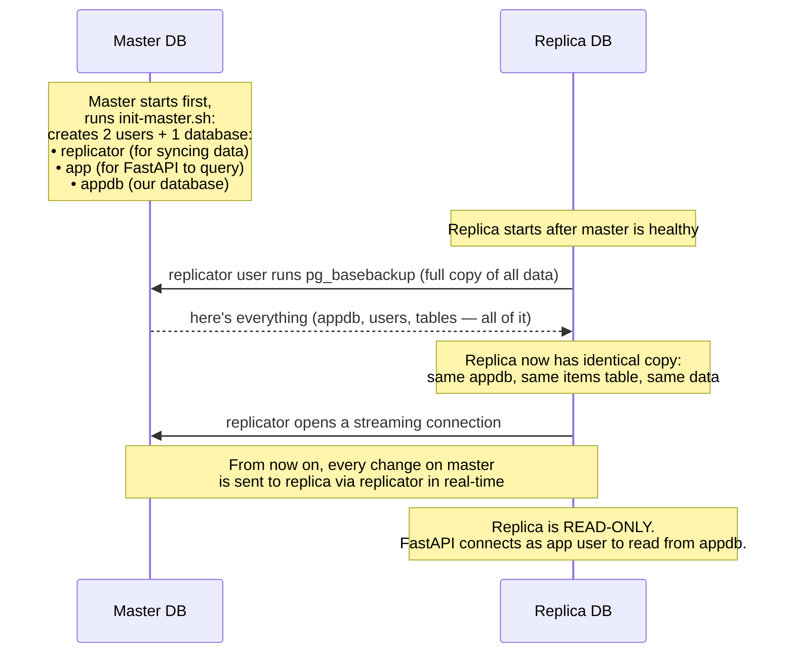
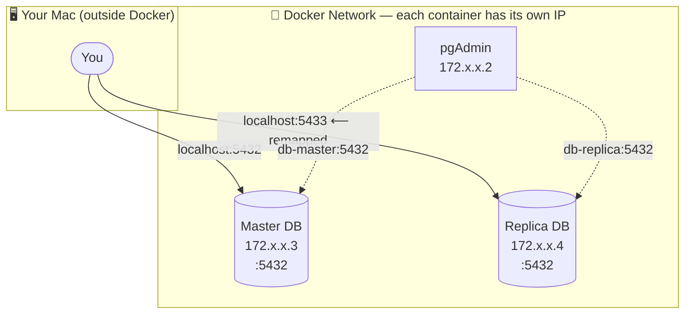

# DB Master-Replica

A minimal FastAPI app demonstrating PostgreSQL master-replica setup with synchronous streaming replication.

## Architecture



## How Replication Works Step by Step



## How the Replica Starts Up



## Who Does What (Users & Database)

| Name | What is it | Purpose |
|------|-----------|---------|
| `app` | PostgreSQL user | FastAPI uses this to connect and run queries (SELECT, INSERT, etc.) |
| `replicator` | PostgreSQL user | Replica uses this to copy and stream data from master |
| `appdb` | Database | The actual database where the `items` table lives |

## Project Structure

```
├── docker-compose.yml     # 3 services: master, replica, api
├── Dockerfile             # FastAPI container
├── Makefile               # up / down / clean
├── pyproject.toml         # python dependencies (uv)
├── app/
│   ├── main.py            # endpoints (GET→replica, writes→master)
│   ├── database.py        # two db connections
│   ├── models.py          # Item table
│   └── schemas.py         # request/response models
└── db/
    ├── init-master.sh     # creates users, enables replication
    └── init-replica.sh    # clones master, starts as read-only copy
```

## Quick Start

```bash
make up       # start everything
make down     # stop containers
make clean    # stop + remove volumes and images
```

## pgAdmin (View Your Databases in Browser)

After `make up`, open [http://localhost:5050](http://localhost:5050)

**Login:** `admin@admin.com` / `admin`

Then add two servers: **Right-click "Servers" → Register → Server**

### Master

| Tab | Field | Value |
|-----|-------|-------|
| General | Name | `Master` |
| Connection | Host | `db-master` |
| Connection | Port | `5432` |
| Connection | Username | `app` |
| Connection | Password | `app` |
| Connection | Maintenance database | `appdb` |

### Replica

| Tab | Field | Value |
|-----|-------|-------|
| General | Name | `Replica` |
| Connection | Host | `db-replica` |
| Connection | Port | `5432` |
| Connection | Username | `app` |
| Connection | Password | `app` |
| Connection | Maintenance database | `appdb` |

### Why port 5432 for both?



> Each container has its **own IP** inside Docker — so both databases can run on `:5432` without conflict.
> On your Mac, `localhost` is a **single IP**, so the replica is remapped to `:5433` to avoid clashing with the master.
> pgAdmin lives **inside** Docker, so it talks to both on `:5432` directly — no remapping needed.

To view data: **Server → appdb → Schemas → public → Tables → items → Right-click → View/Edit Data**


